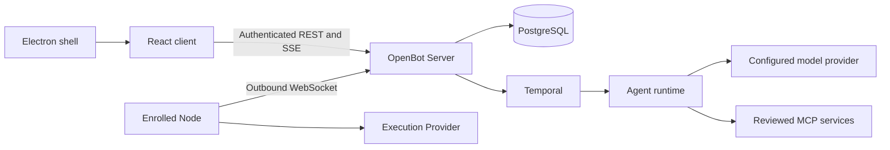

# OpenBot architecture

OpenBot has one authoritative Server, replaceable execution Nodes and one React client shared by
Web and Desktop. This page describes how the parts fit today and what is changing. It is the one
living architecture document. Decisions and their evidence live in [ADRs](decisions/); setup lives in
[CONTRIBUTING](../CONTRIBUTING.md).

## The Server is moving from Python to TypeScript

[ADR-0050](decisions/0050-typescript-control-plane.md) moves the Server from `apps/server-python`
to `apps/server-ts` one route group at a time. Both use the same PostgreSQL schema
(`packages/db`) and the same wire contracts (`packages/protocol`), so data never moves between them.

| Phase | State |
| --- | --- |
| P0–P2 | Done: shared contracts, the TS public entry, and forwarding to a private Python upstream |
| P3 | Done: when selected, TS owns the Owner session and 109 of the 121 product operations, and is the only SSE publisher |
| P4 | Done: when selected, TS also owns Work execution, its Temporal workers and the agent runtime; open Python histories drain on Python workers |
| P5 | Next: TS becomes the default, Python, its harness and the forwarding code are removed, and `apps/server-ts` is renamed `apps/server` |

Until P5, an installation runs Python unless the TS groups are selected explicitly. The selection
switches, the forwarder and the Python drain are temporary and leave in P5.

## Runtime boundaries

| Component | Responsibility | Authority it does not have |
| --- | --- | --- |
| Server (`apps/server-ts`, `apps/server-python`) | Owner sessions, Bot and channel identity, membership, routing, task state, approvals, audit, agent execution and plugin access | Models and external data cannot override Server policy |
| `apps/web` | Conversations, drafts, task supervision, settings and extension presentation | No database access, provider credentials or authorization decisions |
| `apps/desktop` | Bundles the client, a typed restricted bridge, connection policy and the local Server lifecycle | Renderer content cannot call arbitrary main-process operations |
| `apps/node` | Outbound enrollment, advertised capabilities, assignment lifecycle and Provider dispatch | Declaring a capability does not authorize a task or side effect |
| `providers/*` | Narrow adapters to one execution backend | No ownership of identity, membership, approval or final task state |
| `packages/protocol`, `packages/domain`, `packages/db` | Wire contracts, product types, schema and ordered migrations | A type is not a runtime authorization check |

## Data and state

PostgreSQL stores Bots, channel membership, messages, Runs, task ancestry, approvals, audit, memory
and skills.
- **Submissions.** One channel message reaches at most six exact recipients with one Run each. The
  pair `(source_message_id, bot_id)` prevents duplicate tasks for the same message and Bot. The
  Server validates every recipient before it commits the submission.
- **Transitions.** Task transitions use conditional updates inside transactions. Claims and
  collaboration take explicit advisory or row locks.
- **Removing a member.** This cancels the affected task trees and expires their pending approvals
  before the membership row disappears.
- **Files.** Binary content lives outside the database, behind Server-owned metadata and
  authenticated access. Mentioning an attachment ID does not grant access to it.

## Agents and collaboration

Temporal runs Work durably, and the agent runtime executes each Run against the configured model.
- **Untrusted inputs.** Every tool is bound to the claimed Run's Bot and channel. The Bot profile,
  memory, skills, messages, webpages, plugin descriptions and colleague results are all untrusted
  guidance.
- **Delegation.** Bots delegate through child tasks that use their own identity and grants.
  Delegation depth, descendants, per-Run budgets and a shared root deadline all have bounds.
- **Steering.** Owner corrections apply at the next model step. They never rewrite completed effects.
- **Unknown outcomes.** An effect whose outcome is unknown is never replayed automatically.
- **Commit.** Final replies, artifact metadata and terminal task state commit together.

See [native Agent](NATIVE_AGENT.md) and [asynchronous collaboration](ASYNC_COLLABORATION.md).

## Nodes, Providers and approvals

Nodes connect outward, advertise real capabilities and capacity, and accept only assignments the
Server issued. The Server reconciles disconnects and sends a cancellation after it durably records a
revocation.
- **Approvals.** An effect that needs approval is approved through the Server's policy path before
  dispatch. A late provider result cannot overwrite a terminal Server state.
- **Docker.** The Docker Provider is a thin adapter to reviewed upstream endpoints. The other
  Provider declarations are not execution support.
- **Support claims.** Before claiming support, check [Provider conformance](PROVIDER_CONFORMANCE.md)
  and [cross-platform boundaries](CROSS_PLATFORM.md).

## Plugins

MCP is the extension transport for reviewed tools, resources and prompts.
- **Installation.** Installing a plugin pins its reviewed manifest, and each Bot has explicit
  grants.
- **Confirmations.** Tools in confirm mode need a fresh decision for their exact arguments.
- **Isolation.** Plugin app content runs in a restricted surface.

See the [plugin guide](PLUGINS.md). OpenBot's Node protocol and channel REST/SSE contracts are separate
from MCP. [Open-source reuse](OPEN_SOURCE_REUSE.md) records upstreams, licenses and attributions,
including the Hermes Agent inspiration for Employee learning.

## Clients and installation

Web and Desktop share the React client over authenticated REST and SSE:
- **Channel SSE** carries messages, task states, progress, transient output and interactions.
- **Workspace SSE** carries wider workspace changes.
- **Reconnect** reloads authoritative snapshots. Not every transient event can be replayed.

Desktop runs the Server locally where packaging is qualified. See
[Desktop installation](DESKTOP_INSTALLATION.md) and [Windows Desktop](WINDOWS_DESKTOP.md). A
successful build is not installed-lifecycle evidence. The office visualization is an optional,
deferred plugin.

## Checks

`npm run check` runs lint, strict type checks, tests, builds, migration checks and the repository
policy checks. `npm run ui:acceptance -- --entry ts` drives the real interface against a disposable
stack. Mocks, real-database tests, rendered acceptance and real-platform execution are different
kinds of evidence; report which one you ran.

Start from the [repository map](../AGENTS.md).
