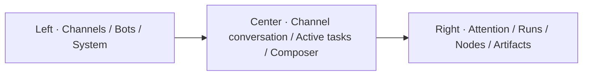
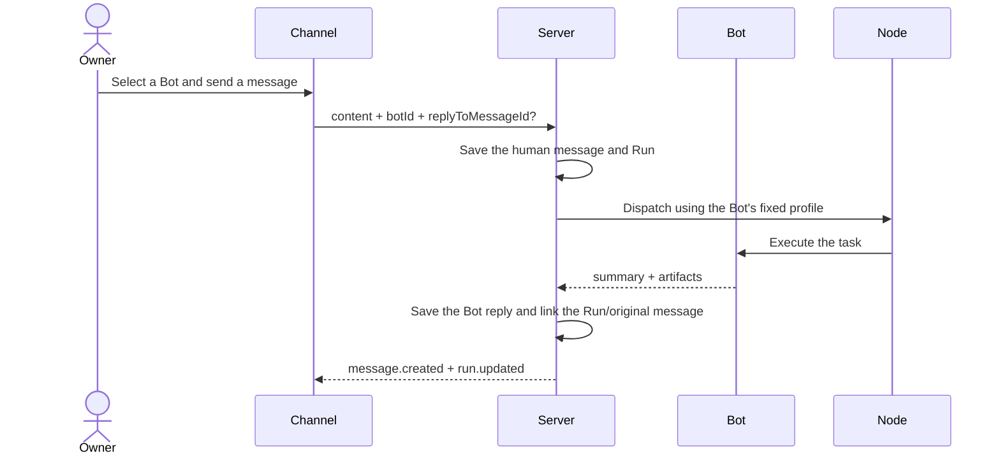

# Interface plan: channels first + optional office plugin

[English](INTERFACE.md) · [简体中文](INTERFACE.zh-CN.md)

## 1. Current direction

The current version centers on **conversations with multiple Bots in persistent channels**. Tencent
Marvis is only a reference for a future spatial overview. The office does not appear in the current
desktop sidebar, mobile navigation, or default Web bundle.

Product formula:

> **Grok Bot-style channels and freely adding Bots + OpenBot's local data, remote Nodes, approvals
> and takeover + an optional Marvis-style office plugin.**

## 2. Four objects

| Object | Meaning | Current interface |
| --- | --- | --- |
| Channel | A persistent work context | Main workspace and message timeline |
| Bot | A digital employee with a name, role, appearance, permissions and fixed execution configuration | Roster, channel member and message author |
| Run | One specific task | Channel activity strip, Inspector, approvals and results |
| Node | A replaceable physical execution machine | Right-panel status and Run details |

A Bot is an employee, a Node is a computer, a Channel is a collaboration space, and a Run is one
piece of work.

## 3. Current desktop structure

- After startup, automatically open the first channel without going through a home page or office.
- When there are no channels, show only the shortest path to creating one.
- The channel header shows Bot members, realtime connection status and the action to add a Bot.
- The message timeline occupies the largest area; the task queue remains a compact activity strip.
- The right panel continues to provide a cross-channel overview of approvals, Nodes and results.

## 4. Channel conversations

Message capabilities:

- A person can explicitly select the Bot that receives a task from the channel members.
- Each task message is linked to a Run.
- When a Run completes, its result is saved under the executing Bot's identity rather than kept
  only in a temporary task card.
- Bot replies can reference the original message and display paragraphs, bold text, lists,
  Markdown tables and screenshot artifacts.
- “Reply” includes the target message in the next task; “Task details” opens the corresponding
  Inspector.
- The composer stays at the bottom; Enter sends, and Shift+Enter inserts a new line.

The current structure supports ongoing conversations between Bots and people. It also retains
authors, reply targets and Run links for future Bot-to-Bot handoffs. Automatically triggering a
second Bot should still use a structured handoff protocol, without guessing from natural-language
`@mention` parsing.

## 5. Composable Bot identity

The user-provided robot design is represented by five composable layers:

This reference defines the NFT-like visual language of composition. At runtime, the structured
selections below are stored instead of repeatedly saving the entire image as avatar data.

| Layer | Current options |
| --- | --- |
| Head | Rounded, square, cat ears |
| Body | Basic, tall, cape, armor, storage, quadruped |
| Mobility | Two legs, single wheel, two wheels, hover, quadruped |
| Accessory | None, headphones, backpack, cloak, mechanical arm, toolbox |
| Accent | Green, yellow, red, blue |

Bot creation provides a live preview of the combined selections. Appearance is stored with the
Bot in local configuration; status only temporarily overrides the accent color or opacity without
changing the identity itself. The current version does not introduce NFT rarity, trading or
on-chain dependencies, but the data model allows composition codes to be exported in the future.

## 6. Employee profile

A Bot avatar is the shared entry point to digital employee details, not decoration. Selecting an
avatar or name in channel members, message authors or the Bot list opens the same employee profile,
independently of the office plugin.

Desktop uses the main content area with a details Inspector; mobile uses a full-screen page. The
first version contains seven fixed sections:

1. `Overview`: identity, role, appearance, current status, model policy and Worker Host.
2. `Evolution`: an evolution timeline with sources and evidence.
3. `Skills`: skill status, versions, prerequisites and verification evidence.
4. `Live`: the current Run, structured observations, concise decision summaries, next steps and approvals.
5. `Memory`: view, search, retain or delete by type and sensitivity level.
6. `Records`: references to tasks, messages, artifacts, failures and audits.
7. `Settings`: role, capability policy, host binding, Routine and migration controls.

`Live` shows an auditable decision trail; it does not show or imply access to a model's private raw
chain of thought. Levels, badges and appearance changes cannot grant execution permissions. Export,
copy and transfer must be separate actions, each previewing the included and excluded data before
execution.

See the [portable digital employee model](EMPLOYEE.md) for detailed data and security boundaries.

## 7. Mobile

Bottom navigation has only three items:

1. `Channels`
2. `Bots`
3. `Approvals`

Channels retain a single-column conversation, horizontally scrolling active tasks, always-visible
reply actions and a composer close to the bottom navigation. Attachments and recording use existing
working capabilities; do not add placeholder buttons without real behavior.

## 8. Office plugin boundary

`@openbot/office-plugin` is a separate workspace package:

- `apps/web` does not depend on it, so the current version neither displays nor loads the office.
- The plugin receives Bots, Channels, Runs, Nodes and an Avatar renderer.
- The plugin can open a Channel or Run, but cannot modify task state itself.
- Plugin styles are exported separately, allowing one or two independent rounds of visual
  refinement later.
- Enabling it will be controlled by future explicit plugin registration and a feature flag.

## 9. Current V1 experience

1. Create a composable `Ops` Bot.
2. Create a channel and add `Ops`.
3. Select `Ops` in the channel composer and issue a task.
4. The activity strip shows execution progress; the Inspector shows the computer, progress and approvals.
5. Sensitive actions stop and wait for the Owner.
6. On completion, `Ops` replies in the channel with results, tables and screenshots.
7. A phone or another computer sees the same messages and status.

The office, a social skill marketplace, a freeform canvas, Bot trading and elaborate decoration are
all excluded from the current version.
